# ERD — relationship map

The full schema is grouped into eleven domains. Each domain is mostly self-contained; cross-domain links happen mainly through `User` and `MediaAsset`.

## Top-down map

```mermaid
flowchart LR
  subgraph IDENTITY[Identity / Auth]
    U[User]
    S[Session]
    EI[ExternalIdentity]
  end

  subgraph BILLING[Subscription / Billing]
    PL[Plan]
    SB[Subscription]
    SE[SubscriptionEvent]
    PM[PaymentMethod]
    INV[Invoice]
    PAY[Payment]
    RF[Refund]
  end

  subgraph CONTENT[Content]
    ART[Article]
    AT[ArticleTranslation]
    AU[Author]
    AA[ArticleAuthor]
    CAT[Category]
    TG[Tag]
    PE[PodcastEpisode]
  end

  subgraph EMAIL[Newsletter]
    NC[NewsletterCampaign]
    NS[NewsletterSubscription]
    NSD[NewsletterSend]
  end

  subgraph LIVE[Live]
    LS[LiveStream]
    LH[LiveStreamHost]
    LA[LiveAttendance]
  end

  subgraph IM[IM Community]
    IG[ImGroup]
    IM2[ImMembership]
  end

  subgraph KYC[KYC]
    KV[KycVerification]
    KD[KycDocument]
  end

  subgraph OPS[Ops]
    AL[AuditLogEntry]
    WH[WebhookEvent]
    RC[ReferralCode]
    RA[ReferralAttribution]
  end

  U -->|owns| SB
  U -->|owns| PAY
  U -->|owns| INV
  U -->|in| IM2
  U -->|attended| LA
  U -->|verified| KV
  U -->|subscribes| NS
  U -->|owns| RC
  U -.->|maps to| EI

  SB -->|on| PL
  SB -->|emits| SE
  SB -->|billed via| INV
  INV -->|paid by| PAY
  PAY -->|refunded by| RF

  ART -->|kind=newsletter| NC
  ART -->|kind=podcast| PE
  ART -->|i18n| AT
  ART --- AA --- AU
  ART --- CAT
  ART -.- TG

  NC -->|sent to| NSD
  NSD -->|recipient| NS

  LS --- LH --- AU
  LS -->|attended by| LA

  IG -->|paywalled by| PL
  IG --- IM2

  KV -->|files| KD

  RC -->|attributes| RA
  RA -.-> U
```

## Key relationships at a glance

| Relationship | Cardinality | FK |
|---|---|---|
| User → Subscription | 1:N | `subscriptions.user_id` |
| Plan → Subscription | 1:N | `subscriptions.plan_id` |
| Subscription → Invoice | 1:N | `invoices.subscription_id` |
| Invoice → Payment | 1:N | `payments.invoice_id` |
| Payment → Refund | 1:N | `refunds.payment_id` |
| Article ↔ Author | M:N | via `article_authors` |
| Article ↔ Tag | M:N | via `article_tags` |
| Article → ArticleTranslation | 1:N (one per locale) | `article_translations.article_id` |
| Article → PodcastEpisode | 1:1 (when `kind=podcast`) | `podcast_episodes.article_id` |
| Article → NewsletterCampaign | 1:1 (when `kind=newsletter`) | `newsletter_campaigns.article_id` |
| NewsletterCampaign → NewsletterSend | 1:N | `newsletter_sends.campaign_id` |
| NewsletterSubscription → NewsletterSend | 1:N | `newsletter_sends.subscription_id` |
| LiveStream ↔ Author (host) | M:N | via `live_stream_hosts` |
| LiveStream → LiveAttendance | 1:N | `live_attendances.live_stream_id` |
| ImGroup ↔ User | M:N (membership) | via `im_memberships` |
| User → KycVerification | 1:N (one per level) | `kyc_verifications.user_id` |
| KycVerification → KycDocument | 1:N | `kyc_documents.verification_id` |
| User → ReferralCode (owner) | 1:N | `referral_codes.owner_id` |
| ReferralCode → ReferralAttribution | 1:N | `referral_attributions.referral_code_id` |

## Indexing summary

The schema declares indexes for the access patterns we expect:

- **Hot path: paywall check** — `users (id)`, `subscriptions (user_id, state)`, `articles (status, required_tier)`. All single-row, all index-only.
- **Hot path: homepage list** — `articles (status, published_at)`. Covered by a composite index.
- **Stripe webhook** — `subscriptions (stripe_customer_id)`, `webhook_events (provider, external_event_id)` unique. Lookup is O(log n).
- **Audit search** — `audit_log_entries (actor_id, created_at)` and `(resource_type, resource_id)`. Compound indexes optimized for "show me everything this user did" and "show me history of this resource".

We deliberately do NOT have a global text-search index. When we need it (Phase 2), we'll add a Postgres `tsvector` column on `article_translations.body_mdx` or hand off to Algolia.

## New domains added in v2

### RBAC (Role / Permission / UserRole / StaffProfile)

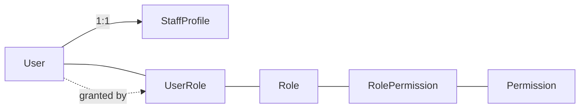

| Relationship | Cardinality | FK |
|---|---|---|
| User → StaffProfile | 1:1 (staff only) | `staff_profiles.user_id` |
| User ↔ Role (assignment) | M:N | via `user_roles` |
| Role ↔ Permission | M:N | via `role_permissions` |
| StaffProfile → StaffProfile (manager) | self-relation | `staff_profiles.manager_id` |

### Behavior tracking

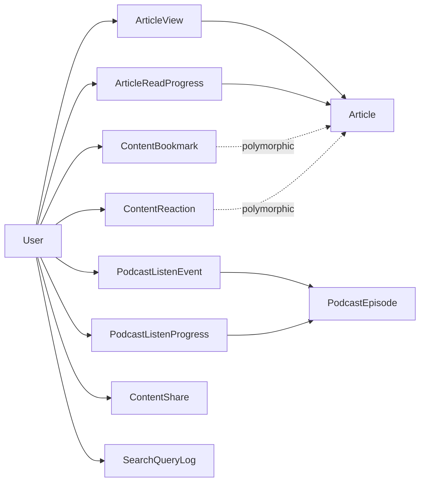

Bookmarks / reactions / shares use polymorphic association (`resource_type` + `resource_id`); no DB-level FK to the target.

### Revisions

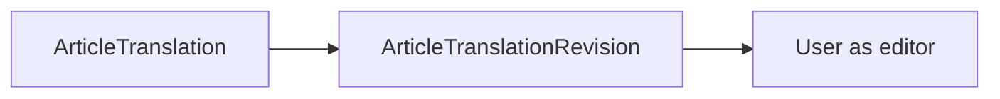

### Legal

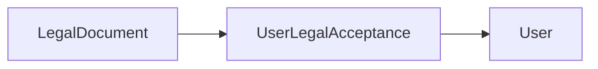

### Media

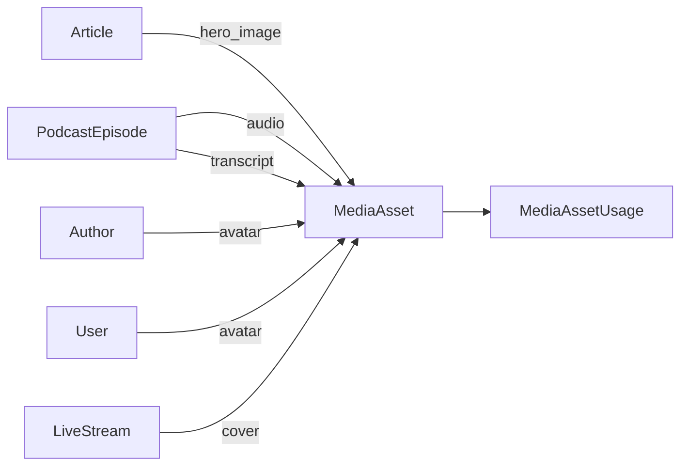

`MediaAssetUsage` is a redundant ledger for "where is this asset used"; direct FKs remain the hot path. App-layer service keeps both in sync.

### Newsletter clicks

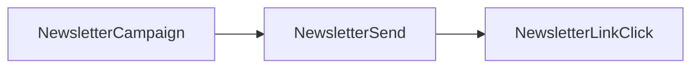

Per-click detail in `NewsletterLinkClick`; per-recipient summary cached on `NewsletterSend`; campaign-level totals cached on `NewsletterCampaign`.

## P0 + P1 domains added in v3

### Notifications

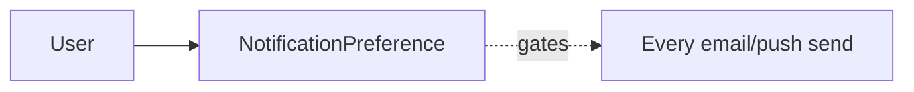

One row per `(user × channel × kind)`. Send services consult this table before every dispatch.

### Coupons & gift subscriptions

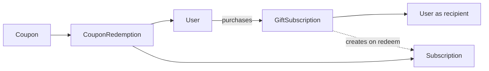

### Compliance workflow

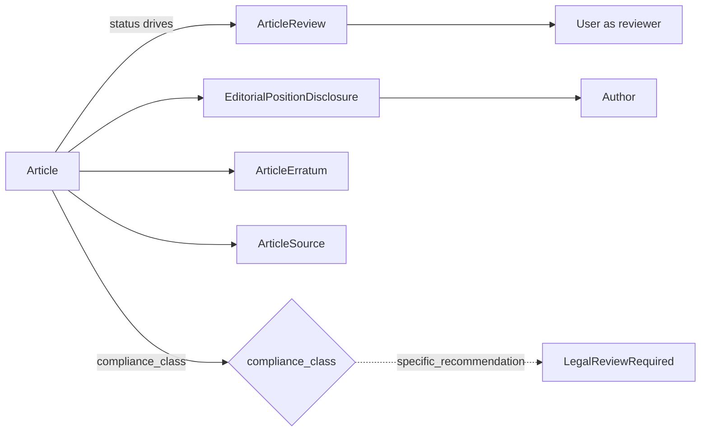

### Auth: device tokens, API tokens, MFA factors

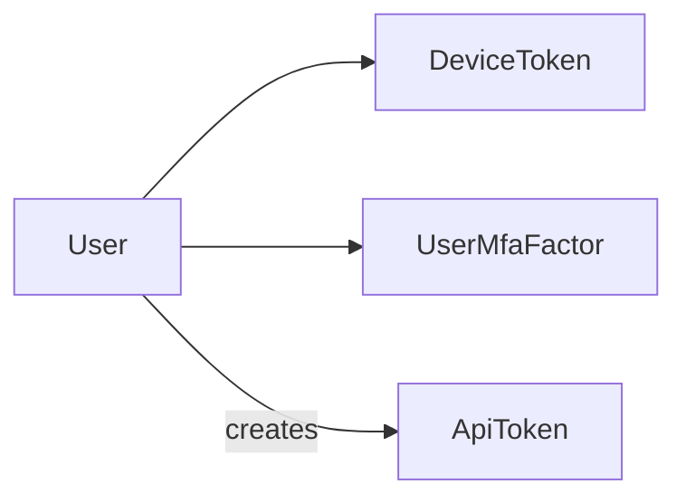

### Financial: credit, payouts

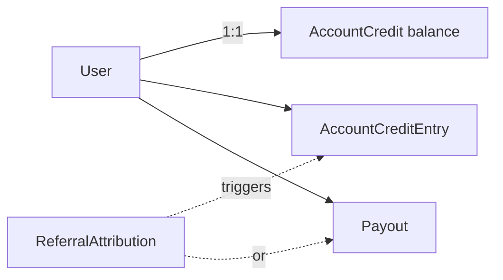

### Live registration & chapters

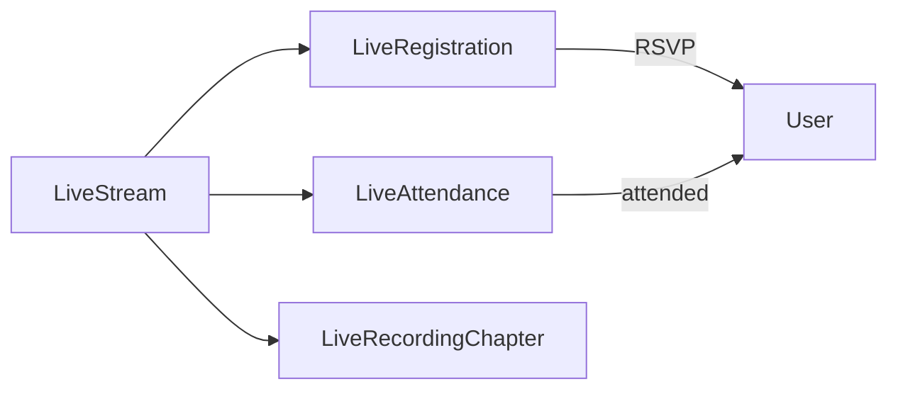

Registration = intent (RSVP). Attendance = actual presence. Two separate funnel stages.

### Platform settings & daily metrics

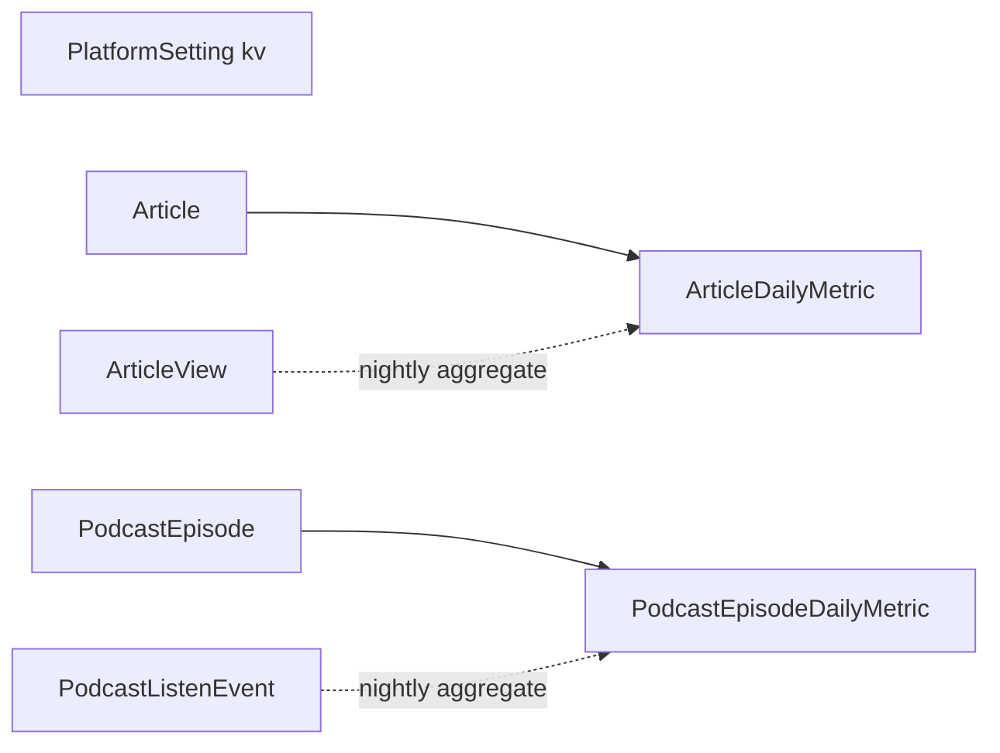

Raw event tables (ArticleView, PodcastListenEvent) truncated at 90 days; daily metric tables kept forever.
