# Lifecycles & state machines

State machines live in two places:

1. **Postgres ENUMs** define which states exist (validated at the DB layer).
2. **`packages/domain` in the prototype repo** defines which transitions are legal (validated at the application layer via `transition()` functions with unit tests).

The DB doesn't enforce the *transition* graph itself — that's deliberate. A migration that re-points a stuck row from `past_due` to `active` is a tool we want available in incident response, and DB-level transition checks would block it. Instead, the application code is the only legal entry point in normal operation.

## Subscription state machine

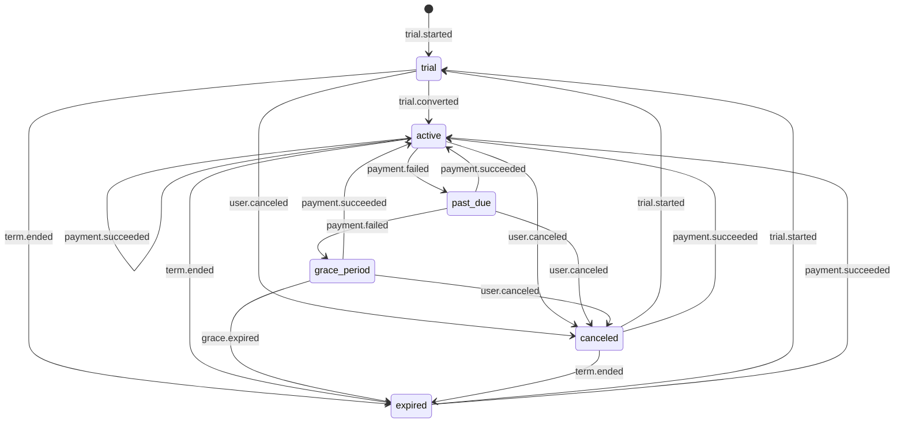

**Entitled states** (`isActive` returns true): `trial`, `active`, `grace_period`. Past-due is NOT entitled — user has full access only during the 7-day grace window after past-due.

**Grace window**: 7 days, set when transitioning past_due → grace_period.

**Implementation**: see `packages/domain/subscription.ts` in the prototype repo and its 9 unit tests.

## KYC verification

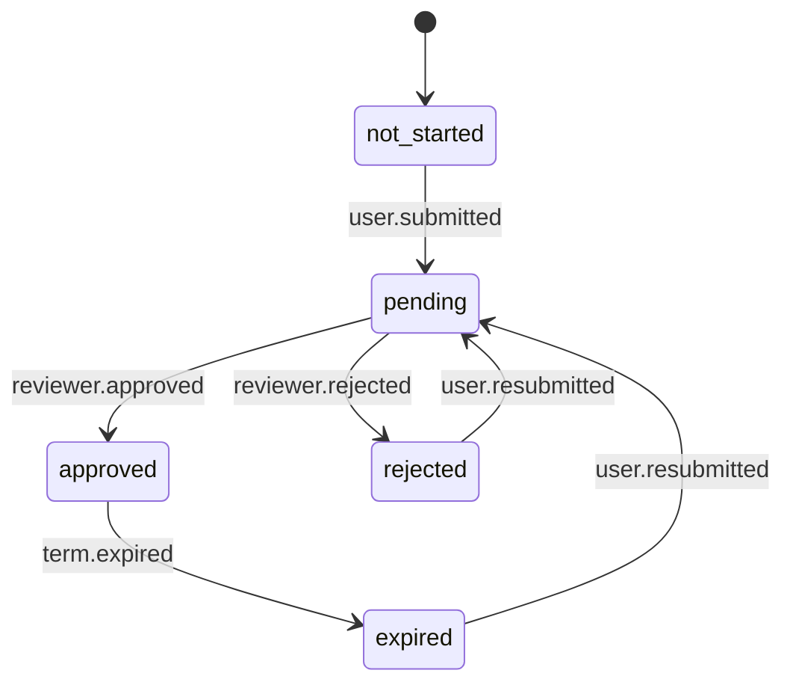

**Levels are independent**: a user can be L0 approved, L1 pending, L2 not_started simultaneously. Each level has its own row in `kyc_verifications`.

**Phase 1 only uses L0** (email + phone), so most users won't have any rows in this table — the absence of a row implies `not_started` for L1+.

## Article publishing

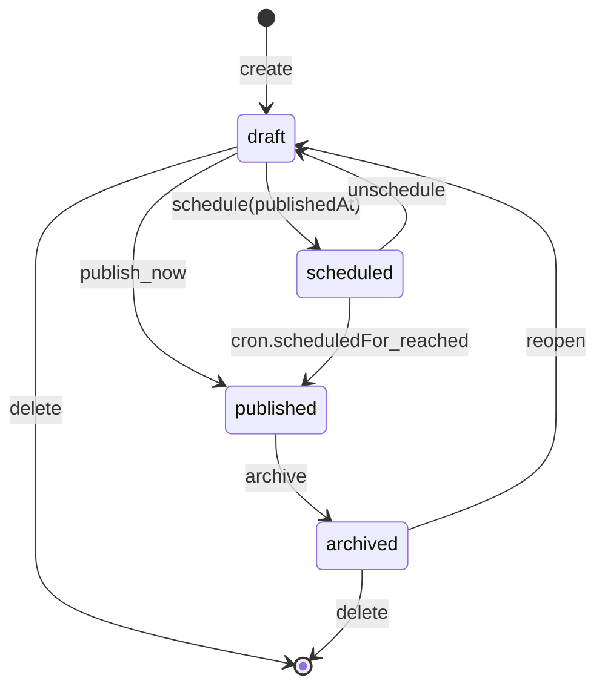

**Translation independence**: `article_translations` rows can be added or edited at any state. The English translation is treated as canonical for slug + SEO defaults.

## Newsletter campaign

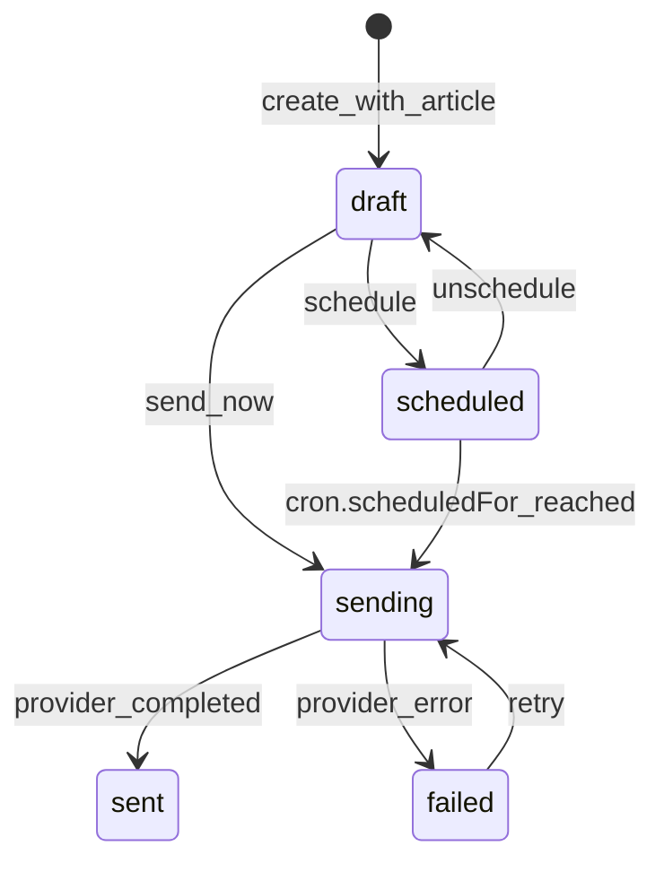

**Per-recipient lifecycle** (`newsletter_sends.status`): `queued → sent → delivered → (opened / clicked / bounced / failed)`. The campaign-level aggregate counters are refreshed by the webhook handler, not computed on the fly.

## Live stream

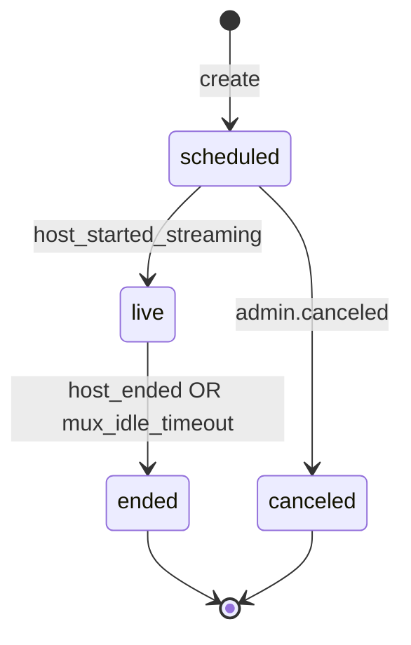

**Recording**: created automatically by Mux when state transitions `live → ended`. The `recording_playback_id` field is stamped by the Mux webhook. `recording_available_until` defaults to `actual_end_at + 30 days` for Premium tier; Pro Desk gets indefinite.

## Webhook event

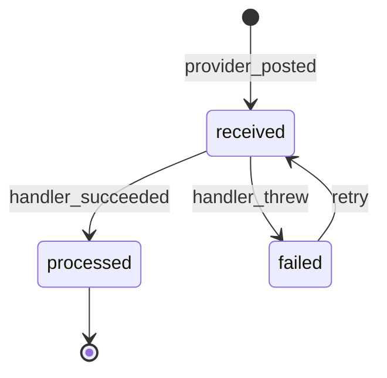

**Idempotency**: the unique constraint on `(provider, external_event_id)` makes the first insert authoritative. If the same event is delivered twice, the second insert raises a unique violation, the handler treats that as "already processed", and the duplicate is dropped.

## Referral attribution

Single-shot, not a state machine:

- `attributed_at` set on signup with a referral code present.
- `converted_at` set when the referee's first paid payment succeeds (i.e. `Subscription.state` enters `active` from `trial`).
- `reward_paid_at` set when the platform credits the referer's account.

## Legal document & acceptance

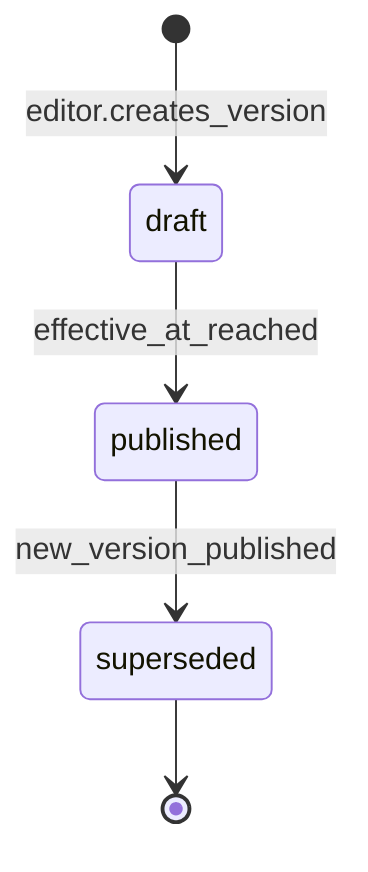

**Acceptance lifecycle** (per user × document version):

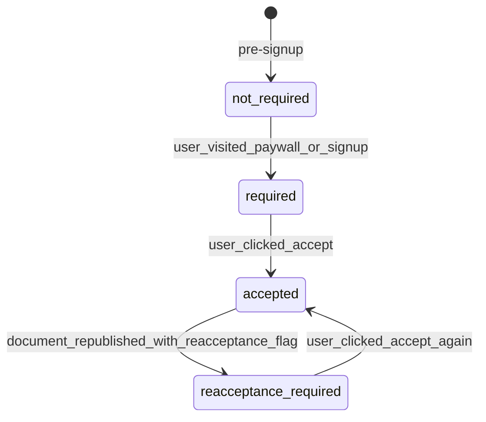

**Why this matters for AITO/Alto**: SEC Reg D, FINRA-adjacent activity, and CSRC future outreach all require provable consent. The `UserLegalAcceptance.accepted_body_hash` field is what makes the proof reproducible — we can show the regulator the exact bytes the user clicked accept on.

## Content revision (ArticleTranslation)

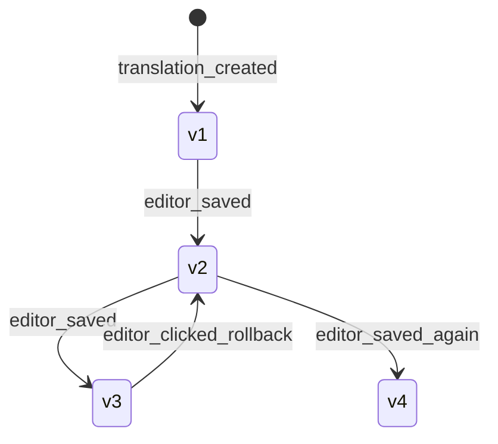

**Versions are monotonic per (translation_id)** — rollback writes a NEW version with `trigger_type = rollback` whose body equals an older version's body. We never decrement `version_number`. This keeps history linear and audit-friendly.

**Implementation note**: every UPDATE to `article_translations` is wrapped in a Prisma middleware that:
1. SELECTs the current row
2. INSERTs a snapshot into `article_translation_revisions` with `version_number = current_version`
3. UPDATEs the row with the new values and `current_version + 1`
All in one transaction, so a crash mid-flow leaves us either fully updated or fully unchanged.

## RBAC grant / revoke

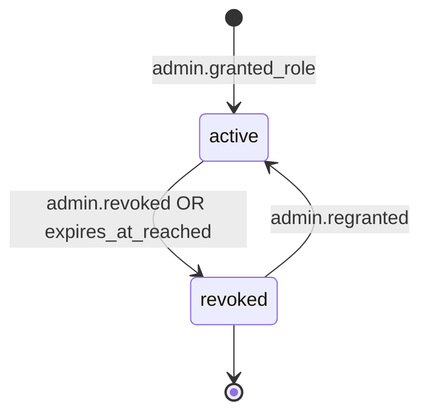

**`UserRole.revokedAt` vs hard delete**: we soft-revoke for audit. A nightly job (planned) can prune revoked rows older than 1 year if storage matters.

## Article publishing — extended (with review workflow)

The original publishing state machine gets two new states (`in_review`, `legal_review`) for financial compliance:

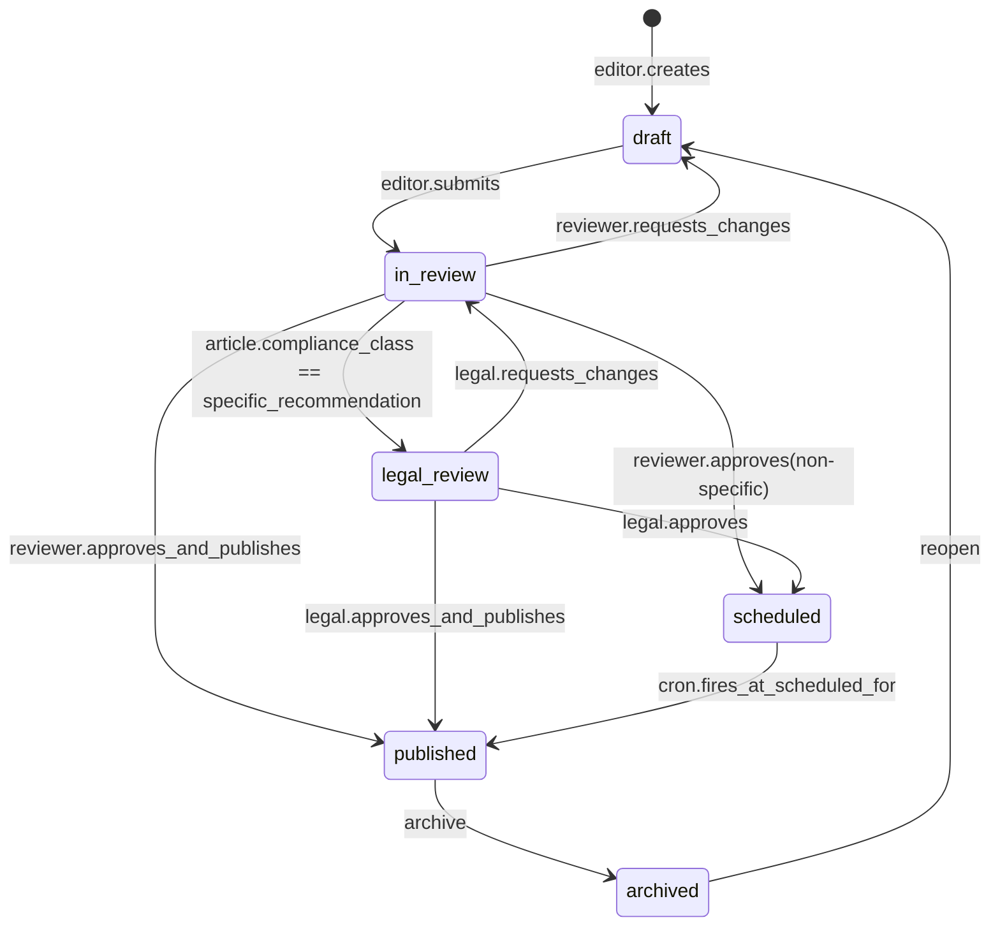

**Gate**: an `ArticleReview` row with `decision = approved` and `reviewedVersion == article.translation.currentVersion` is required to leave `in_review` or `legal_review`. If the article is edited after approval, the gate re-engages (the review is stale).

## Coupon redemption

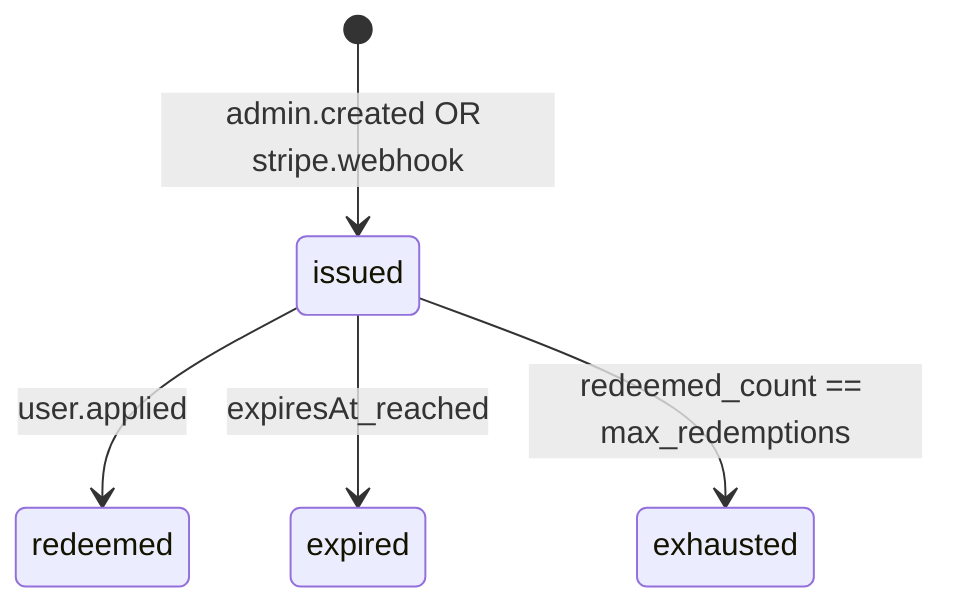

Idempotency: `CouponRedemption.@@unique([couponId, userId, subscriptionId])` blocks a second redemption by the same user on the same subscription.

## Payout

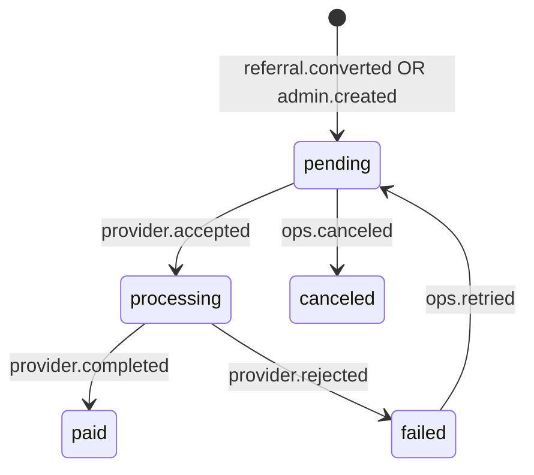

**Provider-level transitions** come from Stripe Connect / PayPal webhooks; the row in `payouts` mirrors the provider's status until it terminalizes (`paid` / `canceled`).

## Gift subscription

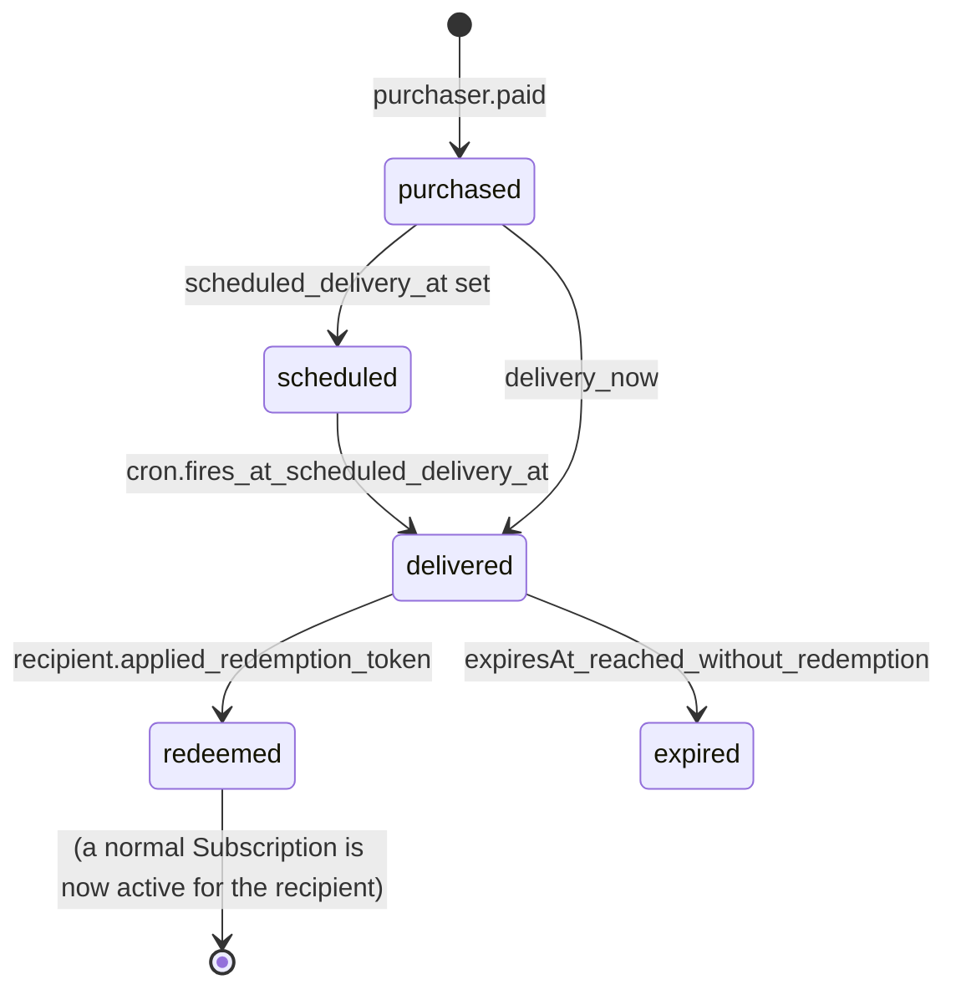

## MFA factor

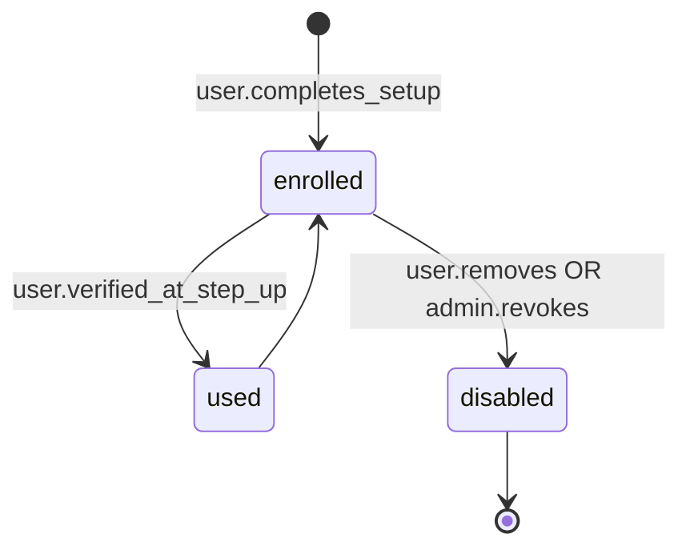

## Bounce → unsubscribe (NewsletterSubscription)

```mermaid
stateDiagram-v2
  active --> bounced : webhook.hard_bounce
  active --> active : webhook.soft_bounce(retry)
  bounced --> active : user.re_subscribes
  active --> complained : webhook.complaint
  complained --> [*] : (never re-enable; treat as permanent)
```

`webhook.soft_bounce` increments a soft-bounce counter (not currently in schema; would be `NewsletterSubscription.softBounceCount`). After N consecutive soft bounces (default 5), the row promotes to `bounced`.

## Where the rules live

| Concern | Source of truth |
|---|---|
| Which states exist | Postgres ENUMs (`prisma/schema.prisma`) |
| Which transitions are legal | TS code in `packages/domain/*.ts` + unit tests |
| Who can trigger a transition | API route handlers + admin role check |
| What to do as a side effect | `subscription_events` outbox → background workers |
| Idempotency | `webhook_events` unique constraint + outbox `processed_at` stamp |
